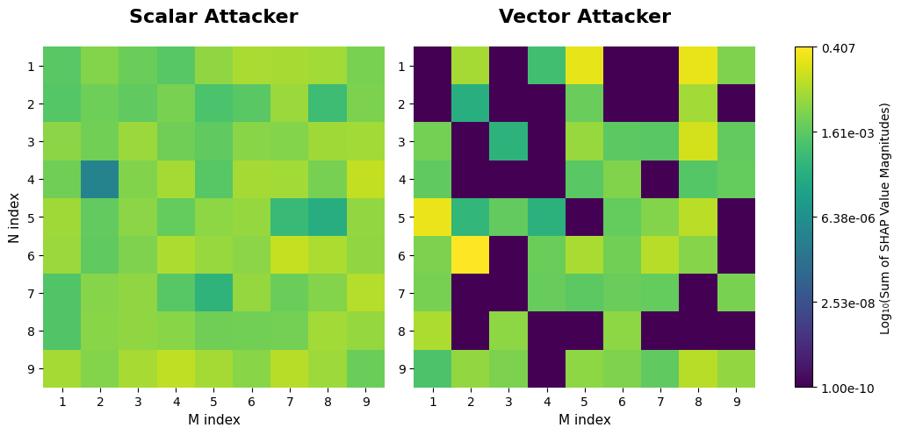
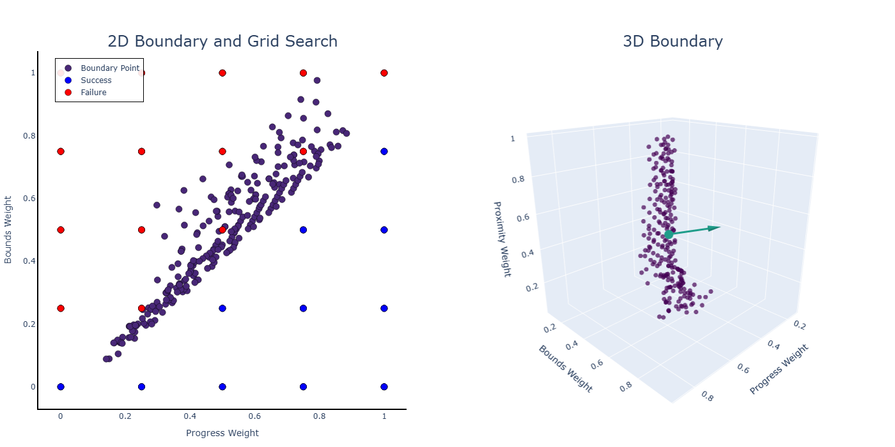

# Scenario Visualization 
 
<p align="center">
  
  
</p>

This repository is a companion repo to [Race Simulation](https://github.com/toazbenj/race_simulation) and includes additional resources for visualizing data generated from [SEMBAS](https://github.com/Thomj-Dev/SEMBAS/tree/example-v0.4.x-race_simulation) and [SHAP](https://github.com/shap/shap).
All the code and data used to generate the plots in "Vector Cost Behavioral Planning for Autonomous Vehicles with Contemporary Validation Strategies" is included. 

Citation:
```
@inproceedings{VectorCostBimatrix,
  title={Vector Cost Bimatrix Games with Applications to Autonomous Racing}, 
  author={Benjamin R. Toaz and Shaunak D. Bopardikar},
  year={2025},
  booktitle={Proceedings of the Modeling, Estimation and Control Conference},
  month = {October},
  year={2025},
  address={Pittsburgh, PA, USA},
  publisher={AACC},
  url={https://arxiv.org/abs/2507.05171},
}
```

## Installation

1. **Clone the Repository**:

   ```bash
   git clone https://github.com/toazbenj/scenario_visualization.git
   ```

2. **Navigate to the Project Directory**:

   ```bash
   cd ~/scenario_visualization
   ```

3. **Install Required Dependencies**:

   Ensure that Python and Pygame are installed on your system. You can install Pygame using pip:

   ```bash
   pip install -r requirements.txt
   ```

## Basic Usage

1. **Launching the Explainable Artificial Intelligence (XAI) GUI**:

   The Scenario Visualization Toolkit features a compact program for creating surrogate models from tabular data. This can be easily passed into SHAP and used for other visualizations.

   ```bash
   cd ~/scenario_visualization/scenario-visualization-toolkit-v1.0.5-dark
   python3 gui.py
   ```

2. **Training models**:

   Select the data file to source. This could include any of the files in the data/grid_search folder or your own. Then select the target feature to use for the surrogate model and confirm. Push train and the models and SHAP data will get saved to the out folder.

3. **Visualization**:

   The plotting output will appear under out/target_feature_name/shap with bar and beeswarm plots of the top feature importances. Additional visualization options and the plotting scripts from the paper are included in processing/paper_plots.ipynb. 
